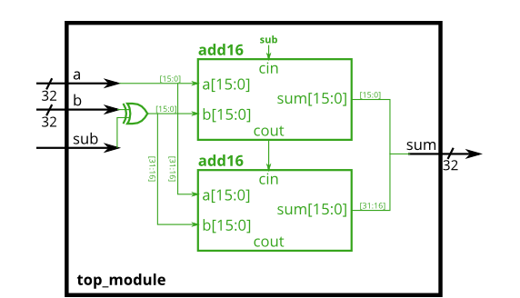

# Problem Statement

An adder-subtractor can be built from an adder by optionally negating one of the inputs, which is equivalent to inverting the input then adding 1. The net result is a circuit that can do two operations: (a + b + 0) and (a + ~b + 1). See [Wikipedia](https://en.wikipedia.org/wiki/Adder%E2%80%93subtractor) if you want a more detailed explanation of how this circuit works.

Build the adder-subtractor below.

You are provided with a 16-bit adder module, which you need to instantiate twice:

```verilog
module add16 ( input[15:0] a, input[15:0] b, input cin, output[15:0] sum, output cout );
```

Use a 32-bit wide XOR gate to invert the b input whenever sub is 1. (This can also be viewed as b[31:0] XORed with sub replicated 32 times. See [replication operator vector 4]().). Also connect the sub input to the carry-in of the adder.

