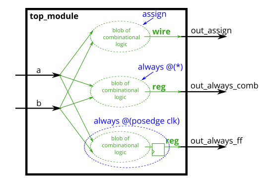

# Problem Statement

Build an XOR gate three ways, using an assign statement, a combinational always block, and a clocked always block. Note that the clocked always block produces a different circuit from the other two: There is a flip-flop so the output is delayed.

> [!TIP]
> For hardware synthesis, there are two types of always blocks that are relevant:
> 
> - Combinational: always @(*)
> - Clocked: always @(posedge clk)
>
> Clocked always blocks create a blob of combinational logic just like combinational always blocks, but also creates a set of flip-flops (or "registers") at the output of the blob of combinational logic. Instead of the outputs of the blob of logic being visible immediately, the outputs are visible only immediately after the next (posedge clk).
>

> [!NOTE]
> ### Blocking vs. Non-Blocking Assignment
>
> There are three types of assignments in Verilog:
> - Continuous assignments (assign x = y;). Can only be used when not inside a procedure ("always block").
> - Procedural blocking assignment: (x = y;). Can only be used inside a procedure.
> - Procedural non-blocking assignment: (x <= y;). Can only be used inside a procedure.
>
> In a combinational always block, use blocking assignments. In a clocked always block, use non-blocking assignments. A full understanding of why is not particularly useful for hardware design and requires a good understanding of how Verilog simulators keep track of events. Not following this rule results in extremely hard to find errors that are both non-deterministic and differ between simulation and synthesized hardware.