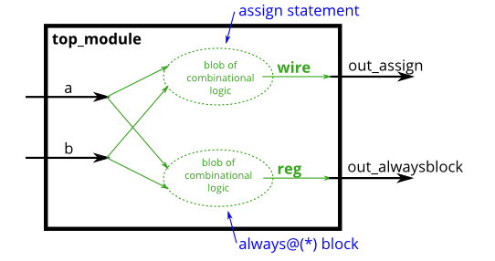

# Problem Statement

Build an AND gate using both an assign statement and a combinational always block. (Since assign statements and combinational always blocks function identically, there is no way to enforce that you're using both methods. But you're here for practice, right?...)

> [!TIP]
> Since digital circuits are composed of logic gates connected with wires, any circuit can be expressed as some combination of modules and assign statements. However, sometimes this is not the most convenient way to describe the circuit. Procedures (of which always blocks are one example) provide an alternative syntax for describing circuits.
>
> For synthesizing hardware, two types of always blocks are relevant:
> - Combinational: always @(*)
> - Clocked: always @(posedge clk)
> 
> Combinational always blocks are equivalent to assign statements, thus there is always a way to express a combinational circuit both ways. The choice between which to use is mainly an issue of which syntax is more convenient. **The syntax for code inside a procedural block is different from code that is outside**. Procedural blocks have a richer set of statements (e.g., if-then, case), cannot contain continuous assignments*, but also introduces many new non-intuitive ways of making errors. *(*Procedural continuous assignments do exist, but are somewhat different from continuous assignments, and are not synthesizable.)*
>
> For example, the assign and combinational always block describe the same circuit. Both create the same blob of combinational logic. Both will recompute the output whenever any of the inputs (right side) changes value.
>  
> **assign** out1 = a & b | c ^ d;
> 
> **always** @(*) out2 = a & b | c ^ d;