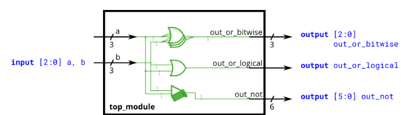

# Problem Statement

Build a circuit that has two 3-bit inputs that computes the bitwise-OR of the two vectors, the logical-OR of the two vectors, and the inverse (NOT) of both vectors. Place the inverse of b in the upper half of out_not (i.e., `bits [5:3]`), and the inverse of a in the lower half.



given:
```verilog
module top_module( 
    input [2:0] a,
    input [2:0] b,
    output [2:0] out_or_bitwise,
    output out_or_logical,
    output [5:0] out_not
);
```

## Bitwise vs. Logical Operators

Earlier, we mentioned that there are bitwise and logical versions of the various boolean operators (e.g., [norgate](https://github.com/Nidhinchandran47/HDLbits-Solutions/tree/main/Verilog%20Language/Basics/Nor%20gate)). When using vectors, the distinction between the two operator types becomes important. A bitwise operation between two N-bit vectors replicates the operation for each bit of the vector and produces a N-bit output, while a logical operation treats the entire vector as a boolean value (true = non-zero, false = zero) and produces a 1-bit output.