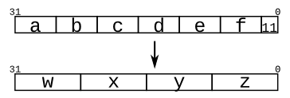

# Problem Statement

Given several input vectors, concatenate them together then split them up into several output vectors. There are six 5-bit input vectors: a, b, c, d, e, and f, for a total of 30 bits of input. There are four 8-bit output vectors: w, x, y, and z, for 32 bits of output. The output should be a concatenation of the input vectors followed by two 1 bits:



```verilog
module top_module (
    input [4:0] a, b, c, d, e, f,
    output [7:0] w, x, y, z );//

    // assign { ... } = { ... };

endmodule
```

### Hint

Part selection was used to select portions of a vector. The concatenation operator {a,b,c} is used to create larger vectors by concatenating smaller portions of a vector together.

```verilog
{3'b111, 3'b000} => 6'b111000
{1'b1, 1'b0, 3'b101} => 5'b10101
{4'ha, 4'd10} => 8'b10101010     // 4'ha and 4'd10 are both 4'b1010 in binary
```
Concatenation needs to know the width of every component (or how would you know the length of the result?). Thus, {1, 2, 3} is illegal and results in the error message: unsized constants are not allowed in concatenations.

The concatenation operator can be used on both the left and right sides of assignments.
```verilog
input [15:0] in;
output [23:0] out;
assign {out[7:0], out[15:8]} = in;         // Swap two bytes. Right side and left side are both 16-bit vectors.
assign out[15:0] = {in[7:0], in[15:8]};    // This is the same thing.
assign out = {in[7:0], in[15:8]};       // This is different. The 16-bit vector on the right is extended to
                                        // match the 24-bit vector on the left, so out[23:16] are zero.
                                        // In the first two examples, out[23:16] are not assigned
```
