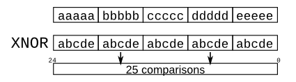

# Problem statement

Given five 1-bit signals (a, b, c, d, and e), compute all 25 pairwise one-bit comparisons in the 25-bit output vector. The output should be 1 if the two bits being compared are equal.

```verilog
out[24] = ~a ^ a;   // a == a, so out[24] is always 1.
out[23] = ~a ^ b;
out[22] = ~a ^ c;
...
out[ 1] = ~e ^ d;
out[ 0] = ~e ^ e;
```



As the diagram shows, this can be done more easily using the replication and concatenation operators.

- The top vector is a concatenation of 5 repeats of each input
- The bottom vector is 5 repeats of a concatenation of the 5 inputs