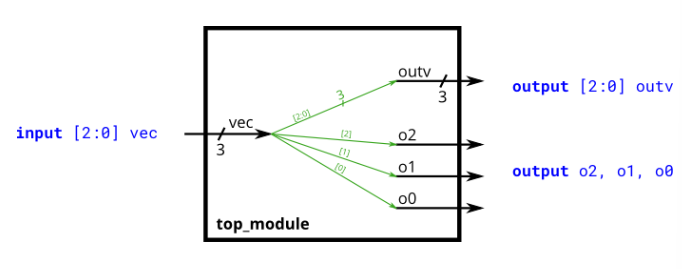

# Problem Statement

Vectors are used to group related signals using one name to make it more convenient to manipulate. For example, wire [7:0] w; declares an 8-bit vector named w that is functionally equivalent to having 8 separate wires.

Notice that the declaration of a vector places the dimensions before the name of the vector, which is unusual compared to C syntax. However, the part select has the dimensions after the vector name as you would expect.

```verilog
wire [99:0] my_vector;      // Declare a 100-element vector
assign out = my_vector[10]; // Part-select one bit out of the vector
```

Build a circuit that has one 3-bit input, then outputs the same vector, and also splits it into three separate 1-bit outputs. Connect output o0 to the input vector's position 0, o1 to position 1, etc.

In a diagram, a tick mark with a number next to it indicates the width of the vector (or "bus"), rather than drawing a separate line for each bit in the vector.

